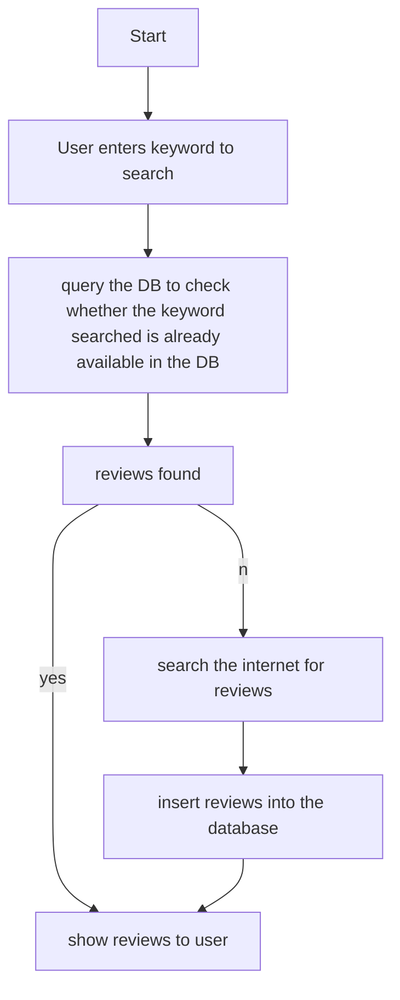

# ReviewScrapper
## A web scraper that collects the reviews of the product from the internet (Here the target is Flipkart). 

### Web scraping is a technique using which the webpages from the internet are fetched and parsed to understand and extract specific information similar to a human being. 

Web scrapping consists of two parts:
-  Web Crawling→ Accessing the webpages over the internet and pulling data from them.
-  HTML Parsing→ Parsing the HTML content of the webpages obtained through web crawling and then extracting specific information from it.
Hence, web scrappers are applications/bots, which automatically send requests to websites and then extract the desired information from the website output.

#### In this project, we’ll take the example of buying a phone online from the flipkart and try to scrap the reviews from the website about the phone that we are planning to buy.

### Project flow:

### Final output:

### Output after search:

## Thank You!
